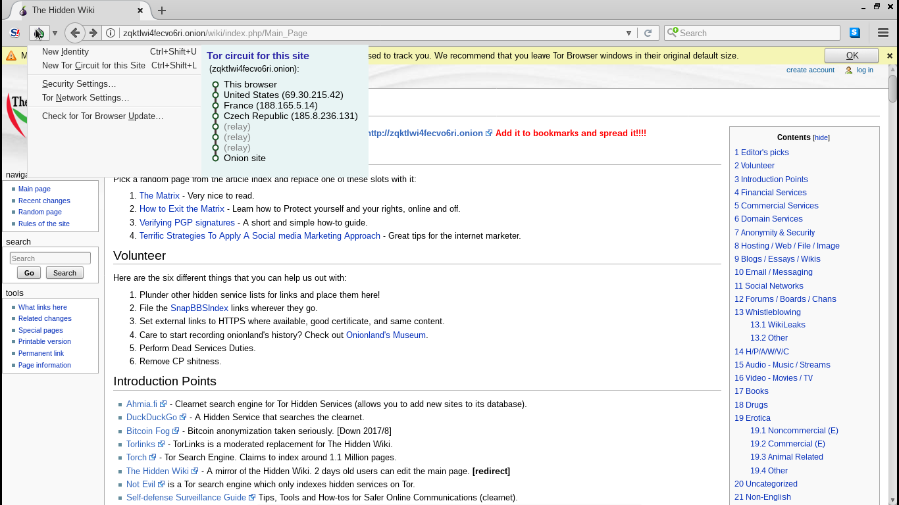
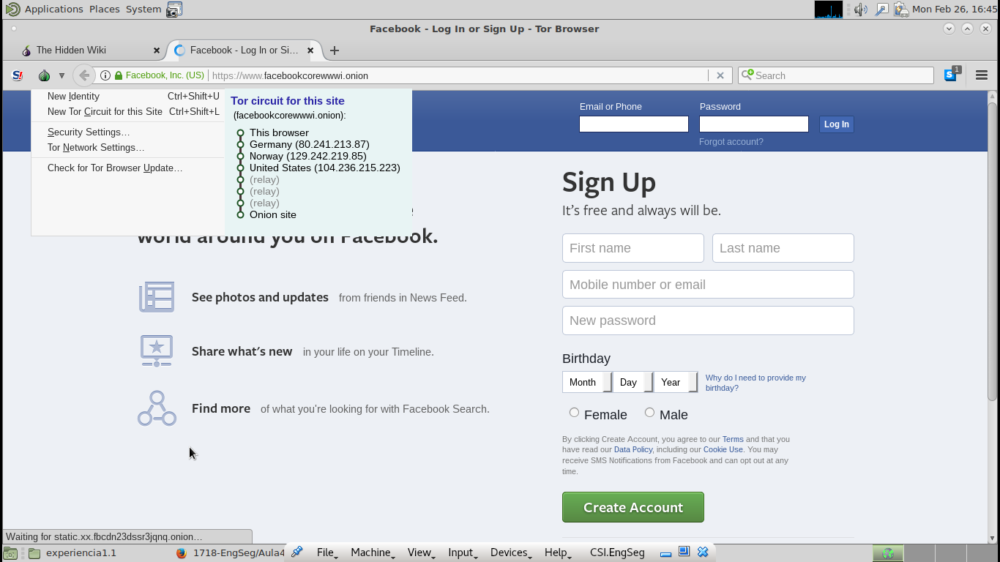

# Relatório da Aula TP - 26/Fev/2018

## Pergunta 1

### P1.1

Não é possível garantir que estamos localizados nos Estados Unidos (EUA), porque este comando não permite especificar os _ORs_ utilizados no protocolo *TOR*. No entanto, o protocolo permite que tal aconteça se se implementar uma aplicação que escolha, de entre os _ORs_ registados no _Directory Server_,  um servidor que esteja nos Estados Unidos como último _OR_.

### P1.2

- Circuito quando se acede ao site http://zqktlwi4fecvo6ri.onion/wiki/index.php/Main_Page	 

  ​

- Circuito quando se acede ao site https://www.facebookcorewwwi.onion/ 

Para aceder ao serviço anónimo, o utilizador do serviço começa por aceder ao Directory Server para extrair informação sobre os _Introduction Points_ (IP)  e a chave pública do serviço anónimo XYZ.onion. De seguida, cria um circuito TOR até um _Rendez-Vouz_ point (RP) - para conexão com o serviço anónimo - fornecendo-lhe um _rendez-vouz cookie_ (um segredo aleatório único para posterior reconhecimento do XYZ.onion). O utilizador do serviço abre uma stream até um dos IP's do serviço anónimo a quem envia uma mensagem, cifrada com a chave pública do serviço anónimo, com a informação sobre o RP, o _rendez-vouz cookie_ e a sua parte da chave de sessão Diffie-Hellman. O serviço anónimo, para responder ao utilizador, constrói um circuito TOR até ao RP do utilizador, enviando uma mensagem com o _rendez-vouz cookie_, a sua parte da chave Diffie-Hellman e o Hash da chave partilhada. Assim, existe entre o utilizador e o serviço anónimo um circuito de 6 OR's onde cada uma das partes tem apenas conhecimento de metade do circuito. Desta forma, o utilizador do serviço anónimo tem conhecimento dos três OR's até ao RP, mas a partir daí os saltos são _rellay_ porque o utilizador não tem conhecimento dos mesmos, e como o circuito TOR do RP até ao serviço anónimo é de três OR's existem três saltos rellay. 

## Pergunta 2

O grupo escolheu  o realizar o _Projeto 2_ que consiste em desenvolver um gestor de passwords com base em QrCodes. De forma geral, o processo de login deve funcionar da seguinte forma:

- quando o utilizador acede a um website, o mesmo gera um código QR;
- o utilizador lê esse código com o seu telemóvel, no qual já se encontra a aplicação de gestão de passwords instalada;
- uma vez lido o código, a aplicação envia os dados de login ao servidor, de forma a autenticar o utilizador no serviço;

Para atingir este fim, torna-se necessário identificar de forma unívoca cada ligação entre um cliente (o computador do utilizador) e o servidor (o serviço onde o utilizador se pretende autenticar). 

### Passos no processo de autenticação

#### 1. Geração do QR Code

Sempre que se acede a um site em que é necessário fazer *login*, gera-se um QR code que deverá ser lido pelo telemóvel. Para esse fim, pode-se usar um QR que contenha a seguinte informação:

- Identificação do serviço em que se pretende autenticar;
- local para onde as credenciais devem ser enviadas;
- _id_ da ligação entre o cliente e o servidor (de forma a saber em que sessão se está a fazer *login*);
- assinatura por parte do servidor dos campos acima referidos, de forma a provar que o local para onde vão ser enviadas as credenciais é da confiança do servidor;

O facto de utilizarmos técnicas de assinatura digital requere que o sistema seja capaz de lidar com a Infraestrutura de Chave Pública, principalmente no que toca à utilização dos certificados digitais.

**Importante**: O certificado utilizado na assinatura tem de ser da entidade responsável pelo serviço em que o utilizador se pretende autenticar. Caso não se faça esta verificação, o utilizador está vulnerável a que outro serviço que conste na base de dados de credenciais do utilizador peça as credenciais que não correspondem às suas e que estas credenciais sejam enviadas para  o mesmo.

### 2. Leitura do QR Code e Autenticação por parte do cliente

A leitura do código QR poderá ser feita pela aplicação de gestão de passwords ou poderá ser lida por uma aplicação genérica de leitura de QR codes que, depois de ler o código, reencaminha os dados nele contidos para a aplicação de gestão de passwords, doravante chamada de AGP. Quando receber estes dados, a AGP deverá verificar a assinatura digital. Caso a verificação falhe, o pedido é descartado. Caso contrário, executam-se os seguintes passos:

1. Verifica-se se a base de dados de credenciais contém o serviço em que se pretende fazer *login*. Caso não tenha, o programa termina aqui com uma mensagem de erro;
2. O cliente envia de forma encriptada as credenciais para o local indicado pelos dados obtidos através do QR Code, assim como o identificador da sessão; para tal, podem-se usar tecnologias/protocolos já existentes (por exemplo, o TLS).

Reitera-se que a AGP terá de saber lidar com a Infraestrutura de chave pública de forma a poder enviar de forma segura as credenciais.

### 3. Autenticação por parte do servidor

Uma vez recebidas as credenciais, o servidor deverá proceder à autenticação com as mesmas. Se as credenciais estiverem corretas, deverá enviar uma resposta para o cliente ligado ao servidor de login bem sucedido. caso contrário, deverá avisar o utilizador que as credenciais são inválidas.

**Nota**: poderá ser necessário ter em conta aspetos temporais, nomeadamente o tempo de vida de cada ligação (e consequentemente, o tempo de vida de cada id de ligação).

